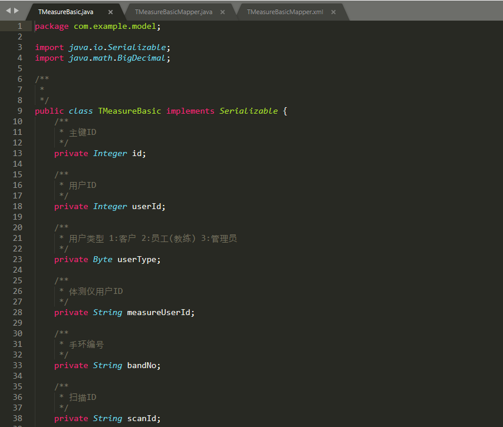

# mybatis-generator 图形工具

生成代码工具

### 使用方式

1. 克隆源码
2. 在项目根目录下执行命令 `gradlew jfxJar` 打包
3. 找到 `generator-client/build/jfx/app/generator-client.jar`文件
4. 执行命令 `java -jar generator-client.jar`启动

### 新建连接

### 基础配置

### Model配置

### Mapper配置

### 字段自定义

### 生成的实体类

### 生成的mapper

### 生成的SQL

